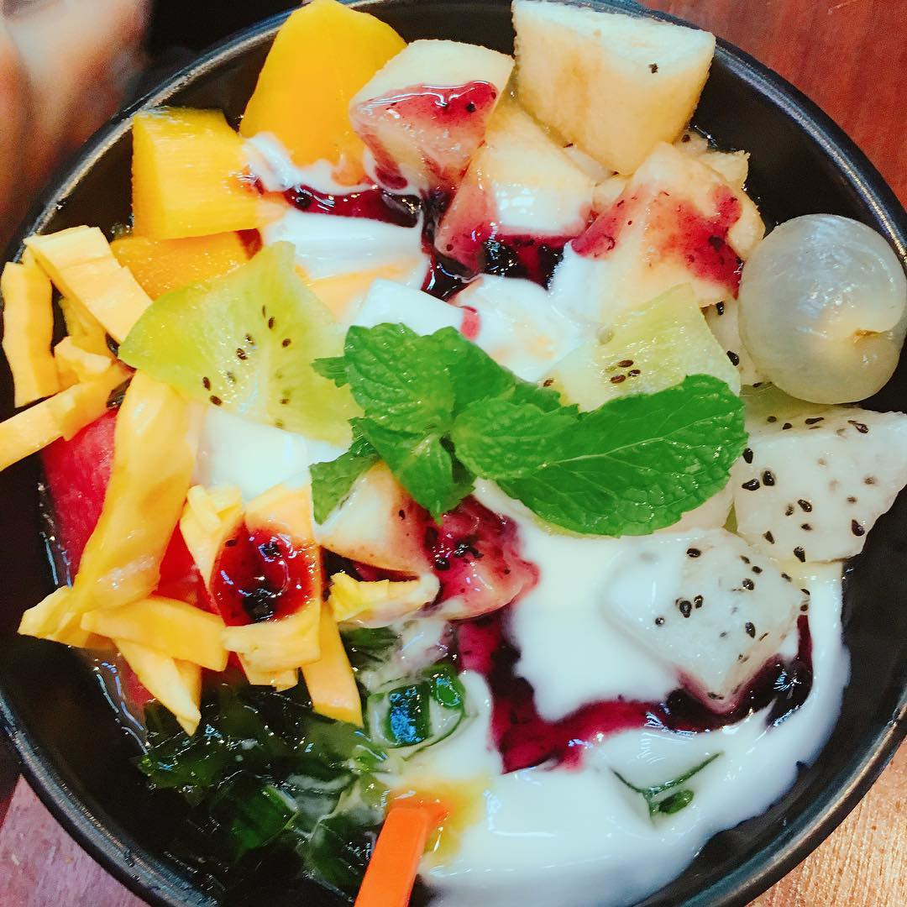

# MENU 

# I. MỤC BÁNH MÌ

**1.BÁNH MÌ BÒ NƯỚNG + NƯỚC SỐT BÒ.………………………...20K**

**2.BÁNH MÌ XÁ XÍU + NƯỚC SỐT…………………………………..18K** 

**3.BÁNH MÌ THẬP CẨM + NƯỚC SỐT……………………………...16K**

**4.BÁNH MÌ GÀ XÉ + NƯỚC SỐT …………………………………...16K**

**5.BÁNH MÌ PATE-TRỨNG + NƯỚC SỐT…………….…………….15K**

# II. MỤC NƯỚC ÉP

**1.NƯỚC ÉP CHANH TƯƠI…………………………..10K**

**2.NƯỚC ÉP CÀ RỐT…………………………………12K**

**3.NƯỚC ÉP DỨA……………………………………..15K**

**4.NƯỚC ÉP CHANH LEO……………………………15K**

**5.NƯỚC ÉP DƯA HẤU………………………………15K**

**6.NƯỚC ÉP CAM TƯƠI……………………………...20K**

**7.NƯỚC ÉP ỔI……………………………………….. 20K**

**8.NƯỚC ÉP CÓC BAO TỬ…………………………...20K**

**9.NƯỚC ÉP TÁO…………………….……………….20K**

**10.NƯỚC ÉP VẢI……………………………………..20K**

**11.NƯỚC ÉP MẬN……………………………………20K**

**12.NƯỚC ÉP BƯỞI …………………………………..25K**

# 2.MỤC TRÀ

**1.DILMAH DÂU nóng/đá….…………………………12k**

**2.DILMAH ĐÀO nóng/ đá.…………………………...12k**

**3.DILMAH BẠC HÀ nóng/đá………………………...12k**

**4.TRÀ LIPTON nóng/đá………….…………………..12K**

**5.TRÀ GỪNG…………………………………………12K**

**6.TRÀ ĐÀO SẢ QUẤT nóng/đá..…………………….25K**

**7.TRÀ ĐÀO CAM SẢ nóng/đá……………………….25k**

**8.TRÀ Ô LONG CAM ĐÀO nóng/đá………………...25k**

**9.TRÀ NHÀI CAM ĐÀO nóng/đá……………………25k**

# 3.MỤC NƯỚC ÉP MIX VỊ

**1.NƯỚC ÉP CAM  +  CÀ RỐT………………………..20K**

**2.NƯỚC ÉP DỨA  +  CÀ RỐT………………………..20K**

**3.NƯỚC ÉP TÁO  +  DỨA……………………………20K**

**4.NƯỚC ÉP TÁO  +  CÀ RỐT………………………...20K**

**5.NƯỚC ÉP CAM  +  DỨA…………………………....20K**

**6.NƯỚC ÉP CAM  +  TÁO…………………………….20K**

**7.NƯỚC ÉP CÓC  +  ỔI………………………………..20K**

# 4.MỤC SINH TỐ

**1.SINH TỐ DỨA……………………………………….20K**

**2.SINH TỐ CÀ RỐT…………………………………...20K**

**3.SINH TỐ XOÀI ……………………………………...20K**

**4.SINH TỐ CHUỐI…………………………………….20K**

**5.SINH TỐ CHANH LEO……………………………...20K**

**6.SINH TỐ DƯA HẤU………………………………...20K**

**7.SINH TỐ ĐU ĐỦ…………………………………….20K**

**8.SINH TỐ MÃNG CẦU………………………………25K**

**9.SINH TỐ BƠ…………………………………………25K**

**10.SINH TỐ DÂU TÂY………………………………..25K**

**11.SINH TỐ CAM  +  CHUỐI…………………………25K**

**12.SINH TỐ DỨA  +  XOÀI…………………………...25K**

**13.SINH TỐ CAM  +  NHA ĐAM……………………..25K**

**14.SINH TỐ MÃNG CẦU  +  BƠ…...…………………30K**

**15.SINH TỐ BƠ  +  XOÀI……………………………..30K**

**16.SINH TỐ DỨA  +  XOÀI  +  CHUỐI………………30K**

# 5.MỤC SỮA CHUA

**1.SỮA LẮC…………………………………………….10K**

**2.SỮA CHUA MÍT…………………………………… 15K.**

**3.SỮA CHUA ĐÁNH ĐÁ……………………………..15K**

**4.CHANH TUYẾT……………………………………..20K**

**5.SỮA CHUA ĐÁNH ĐÁ CA CAO…………………..20K**

**6.SỮA CHUA ĐÁNH ĐÁ BẠC HÀ...………………...20K**

**7.SỮA CHUA ĐÁNH ĐÁ VIỆT QUẤT………………25K**

**8.SỮA CHUA ĐÁNH ĐÁ MÂM XÔI………………...25K**

**9.SỮA CHUA ĐÁNH ĐÁ DÂU TÂY………………...25K**

**10.SỮA CHUA ĐÁNH ĐÁ XOÀI…………………….25K**

# 6.SODA

**1.SODA VIỆT QUẤT………………………………….20K**

**.SODA BẠC HÀ……………………………………...20K**

**3.SODA DÂU TÂY……………………………………20K**

**4.SODA MÂM XÔI……………………………………20K**

# 7.HOA QUẢ DẦM

**1.HOA QUẢ DẦM KEM………………………………..30K**

**2.HOA QUẢ DẦM SỮA CHUA………………………..30K**

DONE!